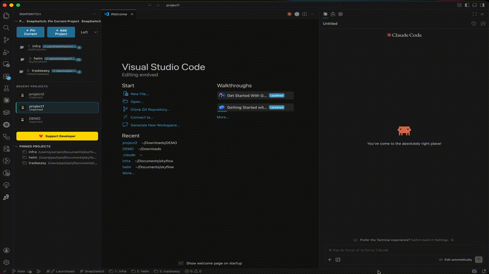
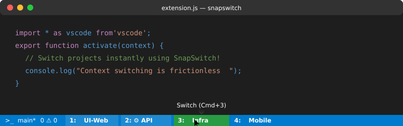

# SnapSwitch for VS Code

[](https://marketplace.visualstudio.com/items?itemName=JYashSakariyaJain.snapswitch-vscode)
[](https://open-vsx.org/extension/JYashSakariyaJain/snapswitch-vscode)
[](https://marketplace.visualstudio.com/items?itemName=JYashSakariyaJain.snapswitch-vscode)
[](https://github.com/spinykiller/snapswitch/blob/main/LICENSE)

One-click project switching for VS Code — launch into your full project context instantly.





## 🛑 The Problem
Working on a **multi-project setup** (especially on Mac) can be incredibly messy. There is **no native `Cmd+Tab` / `Ctrl+Tab` support** for switching between specific VS Code windows. Falling back to the window menu or native dock takes **more than 3 clicks** and completely breaks your flow. 

## ⚡ The Solution
**SnapSwitch** pins your projects directly into the bottom status bar and sidebar.
- See your entire project workspace at a glance.
- One click to switch immediately to that project window.
- Or simply press `Cmd + <Project Number>` to switch instantly.
Less clicking, zero mess—context switching made completely frictionless.

## ✨ Features

- **One-click status bar buttons** with prepended shortcuts (e.g. `1: Frontend`)
- **Keyboard Shortcuts**: Switch between projects instantly with `Cmd + 1-9`
- **Drag-and-Drop Sidebar Dashboard**: Manage, edit, and reorganize projects smoothly!
- **Git State Indicators**: Live Git branch & uncommitted changes directly on UI badges
- **Customization & Grouping**: Tag your projects under sub-folders or assign dynamic Codicons!
- **Extended Workspace Syncing**: `.code-workspace` native support along with Analytics and Auto-Recent project logs.
- **Quick Terminal Access**: Open or focus your terminal instantly from the status bar, sidebar button, or using `` Cmd + ` `` / `Cmd + ₹`.

## Install

**From a Marketplace** (recommended):
- [VS Code Marketplace](https://marketplace.visualstudio.com/items?itemName=JYashSakariyaJain.snapswitch-vscode) — search "SnapSwitch" in the Extensions tab
- [Open VSX Registry](https://open-vsx.org/extension/JYashSakariyaJain/snapswitch-vscode) — for VS Codium / open-source VS Code builds

**From source** (dev):
```bash
npx --yes vsce package --no-dependencies
# Then: Command Palette → Extensions: Install from VSIX...
```

## Usage

| Action | How |
|---|---|
| Pin current project | Command Palette → **SnapSwitch: Pin Current Project** |
| Switch project (one click) | Click a project button in the Status Bar |
| Switch project (shortcut) | **Cmd + <Number>** (1-9) for pinned projects |
| Switch project (picker) | Command Palette → **SnapSwitch: Switch Project** |
| Switch project (side bar) | Open **Pinned Projects** view and click a project |
| Quick Terminal Access | Click Terminal in Status Bar/Sidebar or **Cmd + \`** / **Cmd + ₹** |

## Support & Donation

If you find SnapSwitch useful, consider supporting the development:
- [GitHub Sponsors](https://github.com/sponsors/spinykiller)
- [Support via Sidebar Dashboard]

## How It Works

Projects are saved globally in VS Code settings (`projectTabs.projects`).  
Clicking a tab runs `vscode.openFolder` — same as File → Open Folder — switching full context.

## Settings

- `projectTabs.statusBarMaxItems`: number of pinned projects to show as one-click Status Bar buttons (0–20)
